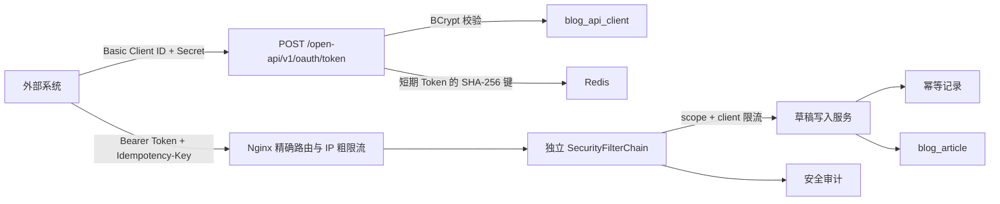

# NovaMall 外部博客写入 API

## 1. 目标与边界

本接口用于受信任的外部系统以机器身份向 NovaMall 写入博客草稿。它与管理后台登录完全隔离：不创建 `sys_user`，不调用 `/login`，不复用后台 JWT，也不开放原有 `/blog/article`。

首期边界：

- 支持 Client Credentials 换取短期、固定过期的 opaque Bearer Token；
- 支持查询分类、标签；
- 支持创建草稿，外部请求不能指定发布状态；
- 支持分页查询和查看当前客户端自己创建的文章；
- 支持数据库级幂等、客户端级限流和安全审计；
- 暂不支持外部发布、更新、删除、文件上传和远程图片抓取。

设计依据：[OAuth 2.0 Client Credentials](https://www.rfc-editor.org/rfc/rfc6749.html#section-4.4)、[Bearer Token Usage](https://www.rfc-editor.org/rfc/rfc6750.html) 和 [OWASP API Security Top 10](https://owasp.org/API-Security/editions/2023/en/0x11-t10/)。



## 2. 实施计划与当前完成状态

- [x] 从最新 `master` 创建独立开发分支；
- [x] 新增客户端、幂等、审计和文章来源迁移；
- [x] 新增客户端管理接口与管理页面；
- [x] 新增独立机器认证链、短期令牌和 scope 权限；
- [x] 新增分类、标签、草稿创建、自有文章列表和详情接口；
- [x] 新增 Nginx 路由、请求体限制、限流、短超时和 Request ID；
- [x] 新增功能开关、生产部署变量和后端端口收口；
- [x] 完成 JDK 17 全后端编译、前端生产构建和 Compose/YAML 静态校验；
- [ ] 在目标环境手工执行 V2.7 数据库迁移；
- [ ] 创建首个客户端并进行真实 MySQL/Redis/Nginx 冒烟；
- [ ] 将生产功能开关灰度设为 `true`。

根据当前项目约定，本次不新增自动化测试和质量门禁。

## 3. 权限范围

| Scope | 能力 |
|---|---|
| `blog.article.create` | 创建草稿 |
| `blog.article.read.own` | 查询该客户端自己创建的文章 |
| `blog.taxonomy.read` | 查询分类和标签 |

客户端停用或 Secret 轮换后，后端会检查 `status` 和 `secret_version`，已签发的旧 Token 立即失效。Token 不提供刷新能力，到期后重新调用 Client Credentials 接口。

## 4. 管理员配置

1. 在部署本版本后端代码之前，按 [数据库升级说明](./database-upgrade.md) 执行 `sql/V2.7.0__blog_external_write_api.sql`；启动预检始终核对结构，缺失时应用不会进入健康状态。
2. 部署应用，但保持 `BLOG_EXTERNAL_API_ENABLED=false`。
3. 使用管理员账号进入“AI博客 → 外部API客户端”。
4. 新建客户端，选择最小必要 scope、每分钟限额和 Token 有效期。
5. 立即保存一次性展示的 Client ID 与 Client Secret。数据库只保存 BCrypt Hash，Secret 丢失后只能轮换。
6. 将 `BLOG_EXTERNAL_API_SCHEMA_READY=true`，由启动预检核对三张表、三列和唯一索引。
7. 配置负载均衡或反向代理的固定私网地址 `BLOG_EXTERNAL_API_TRUSTED_PROXY_IP`。外部 API location 会按原始对端地址拒绝绕过该代理的直连请求。
8. 完成内部冒烟后设置 `BLOG_EXTERNAL_API_ENABLED=true` 并重新部署。

建议 Token 有效期保持 5–15 分钟；系统默认 15 分钟，最大 60 分钟。

## 5. 获取访问令牌

```http
POST /open-api/v1/oauth/token
Authorization: Basic base64(client_id:client_secret)
Content-Type: application/x-www-form-urlencoded

grant_type=client_credentials&scope=blog.article.create%20blog.article.read.own%20blog.taxonomy.read
```

响应：

```json
{
  "access_token": "nmb_xxxxxxxxxxxxxxxxxxxxxxxxxxxxxxxxxxxxxxxxxxx",
  "token_type": "Bearer",
  "expires_in": 900,
  "scope": "blog.article.create blog.article.read.own blog.taxonomy.read"
}
```

PowerShell 示例：

```powershell
$clientId = '<client-id>'
$clientSecret = '<client-secret>'
$basic = [Convert]::ToBase64String([Text.Encoding]::GetEncoding('ISO-8859-1').GetBytes("${clientId}:${clientSecret}"))
$tokenResponse = Invoke-RestMethod `
  -Method Post `
  -Uri 'http://example.com/open-api/v1/oauth/token' `
  -Headers @{ Authorization = "Basic $basic" } `
  -ContentType 'application/x-www-form-urlencoded' `
  -Body 'grant_type=client_credentials'
$accessToken = $tokenResponse.access_token
```

## 6. 查询分类与标签

```http
GET /open-api/v1/blog/categories
Authorization: Bearer <access-token>
```

```http
GET /open-api/v1/blog/tags
Authorization: Bearer <access-token>
```

两者都要求 `blog.taxonomy.read`。

## 7. 创建博客草稿

```http
POST /open-api/v1/blog/articles
Authorization: Bearer <access-token>
Idempotency-Key: publish-job-20260812-0001
Content-Type: application/json

{
  "externalId": "cms-article-10001",
  "title": "NovaMall 外部接口接入说明",
  "summary": "外部内容系统接入示例",
  "contentMarkdown": "# 标题\n\n正文内容",
  "categoryId": 1,
  "tagIds": [1, 2],
  "coverImage": "/uploads/example.png"
}
```

规则：

- `Idempotency-Key` 必填，8–128 个 URL 安全字符；同一客户端内唯一；
- 同一 Key 与相同请求重试时返回原文章，响应头 `Idempotent-Replayed: true`；
- 同一 Key 携带不同请求体返回 `409`；
- `externalId` 可选，但同一客户端内不可重复；
- 正文使用 Markdown，UTF-8 最大 1 MiB；
- `categoryId`、`tagIds` 必须已经存在，标签最多 10 个；
- 服务端固定写入草稿状态 `0`、来源 `EXTERNAL_API`；
- `coverImage` 只接受 `/uploads/` 路径或无用户信息的 HTTPS URL。

成功返回真实 HTTP `201 Created`，并通过 `Location` 指向文章详情。

## 8. 查询自有文章

```http
GET /open-api/v1/blog/articles?pageNum=1&pageSize=20&keyword=NovaMall
Authorization: Bearer <access-token>
```

列表只返回摘要信息，不查询或返回长正文。详情接口：

```http
GET /open-api/v1/blog/articles/{id}
Authorization: Bearer <access-token>
```

服务端在 SQL 查询条件中同时校验 `source_type=EXTERNAL_API` 和 `source_client_id`。访问其他客户端的文章统一返回 `404`，不会泄露资源是否存在。

## 9. HTTP 状态与错误响应

| 状态 | 含义 |
|---|---|
| `201` | 草稿创建成功或幂等重放成功 |
| `400` | 参数、scope、分类、标签或幂等键格式错误 |
| `401` | Client 凭证或 Bearer Token 无效 |
| `403` | Token 缺少所需 scope |
| `404` | 功能关闭、路径不存在或文章不属于当前客户端 |
| `409` | 幂等键冲突、请求处理中或外部文章 ID 冲突 |
| `413` | 请求体或正文超过限制 |
| `415` | Content-Type 不受支持 |
| `429` | Nginx IP 粗限流或后端客户端限流 |
| `5xx` | 服务端、Redis 或数据库暂时不可用 |

错误响应包含稳定的 `error/code`、`message` 和 `requestId`。`401/403` 返回标准 `WWW-Authenticate`，`429` 返回 `Retry-After`。网关生成的 `404/405/413/429` 可能使用 Nginx 默认响应体，但 HTTP 状态保持正确。

## 10. 安全与运维约束

- 生产通过指定负载均衡/反向代理的 HTTP 入口开放 `/open-api/`，Nginx 按原始对端地址拒绝绕过代理的直连。公网 HTTP 会明文传输 Client Secret 和 Bearer Token，链路监听者可能获取完整接口权限。
- 生产后端端口只绑定 `127.0.0.1`，外部调用不得绕过 Nginx。
- Nginx 只信任自己生成的 Request ID，并覆盖转发的来源 IP 请求头。
- Token 原文只返回调用方；Redis Key 使用 Token 的 SHA-256，不记录 Authorization、Secret 或完整正文。
- 审计表记录客户端、路径、状态、请求哈希、文章 ID 和耗时，不保存正文或凭证。
- 数据库迁移必须先于功能开关；`BLOG_EXTERNAL_API_SCHEMA_READY=true` 会执行只读启动预检，结构不完整时应用不进入健康状态。回滚时只关闭 `BLOG_EXTERNAL_API_ENABLED`，不要紧急删表，也不要把 schema-ready 改回 false。
- 后端在 schema-ready 为 true 时按小时分批清理过期 `blog_api_idempotency`，审计默认保留 90 天；因此关闭公开 API 后保留期策略仍继续执行。
- Nginx 为 `/open-api/` 使用不含 Authorization、请求体的 JSON 安全日志，记录 Request ID、来源 IP、状态、上游状态和耗时，网关生成的 404/405/413/429 也可关联排障。
